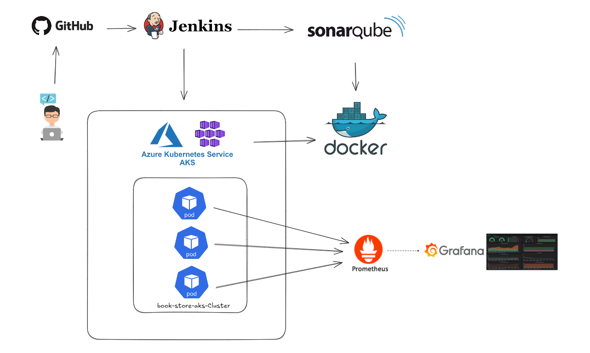

## Book Store — DevOps CI/CD + AKS

## About This Project

A practical DevOps project implementing a full CI/CD pipeline for a Book Store web application. The pipeline uses Jenkins for automation, SonarQube for static analysis and quality gates, Docker for containerization, and deploys to Azure Kubernetes Service (AKS). Monitoring and observability are provided by Prometheus (metrics) and Grafana (dashboards). The repository demonstrates end-to-end modern delivery: automated builds, tests, quality checks, container images, Kubernetes manifests, and monitored production deployment.

Technologies Used

- Jenkins
- SonarQube
- Azure Kubernetes Service (AKS)
- Kubernetes
- Docker
- Prometheus
- Grafana
- Git / GitHub
- Azure
- DevOps practices (CI/CD, Infrastructure as Code)

## Architecture & Illustrations

The service is packaged into a Docker image and deployed to AKS using the provided Kubernetes manifests (`book-store-deploy.yaml`, `book-store-service.yaml`). The CI pipeline builds the image, runs tests and static analysis, pushes the image to a registry, and triggers a deployment to the cluster.

See the included diagrams and screenshots in `imgs/` for architecture and pipeline visuals. Example images contained in this repo:



Project screenshots:


## CI/CD (Jenkins)

- Jenkinsfile is included at the repository root and defines the pipeline stages: checkout, build, test, static analysis (SonarQube), image build + push, and deploy to AKS.
- Jenkins integrates with SonarQube to enforce quality gates before publishing images.
- The pipeline is parameterized so you can point the deployment to different Kubernetes namespaces or registries.

## SonarQube

- Static code analysis is performed during the pipeline. Configure the SonarQube server URL and token in Jenkins credentials.
- Quality gates are used to fail the build when coverage/bugs/vulnerabilities thresholds are not met.

## Local development & running

Prerequisites

- Python 3.8+ and pip (app is a Django project)
- Docker (for building images)
- kubectl (for cluster interaction)
- Azure CLI (for AKS operations)

Run locally (development)

1. Create a virtual environment and install requirements:

```powershell
python -m venv .venv; .\\.venv\\Scripts\\Activate.ps1; pip install -r requirements.txt
```

2. Run the app (Django dev server):

```powershell
python manage.py migrate
python manage.py runserver
```

3. Open http://127.0.0.1:8000/

Container build (local)

```powershell
docker build -t your-repo/book-store:latest .
docker run -p 8000:8000 your-repo/book-store:latest
```

## Deployment to AKS

This repository contains Kubernetes manifests and deployment files (`book-store-deploy.yaml`, `book-store-service.yaml`) and a `Dockerfile` at the repo root.

High-level steps:

1. Build and push the Docker image to your container registry (Docker Hub, ACR, etc.).
2. Update the image references in the Kubernetes manifests if needed.
3. Apply manifests to AKS:

```powershell
kubectl apply -f book-store-deploy.yaml
kubectl apply -f book-store-service.yaml
```

## Monitoring & Observability

- Prometheus is used for metrics collection (Kubernetes metrics and application metrics). Use the provided Prometheus scrape configs in the monitoring manifests (if present).
- Grafana is used for dashboards; example dashboard JSON can be added to `monitoring/grafana/` for import.
- The screenshots in `imgs/` show example Grafana and Prometheus UIs.

## Repository layout (important files)

- `Dockerfile` — builds the Book Store application image
- `Jenkinsfile` — CI/CD pipeline definition
- `book-store-deploy.yaml` — Kubernetes Deployment manifest
- `book-store-service.yaml` — Kubernetes Service manifest
- `requirements.txt` — Python dependencies
- `manage.py`, Django app folders — application source code
- `imgs/` — diagrams and screenshots used in this README

Notes & assumptions

- This README follows the structure you provided and references images that are present in `imgs/`.
- Some environment-specific values (registry, cluster name, credentials) must be set in Jenkins or environment variables; see the pipeline configuration in `Jenkinsfile`.

## Contributing

Contributions are welcome. Please:

1. Fork the repo
2. Create a branch for your change
3. Open a pull request with a description of your change

## License

This project is provided under the MIT License — see `LICENSE` for details.

## Contact

Author: Haythem532002 — https://github.com/Haythem532002
